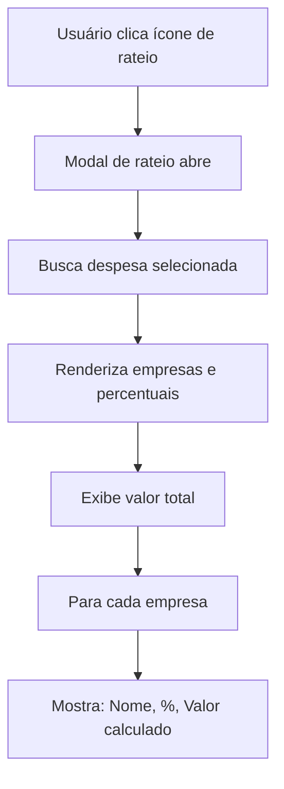

# Documentação Técnica - Módulo de Despesas

## Índice

1. [Visão Geral](#visão-geral)
2. [Arquitetura](#arquitetura)
3. [Estrutura de Dados](#estrutura-de-dados)
4. [Componentes Frontend](#componentes-frontend)
5. [Regras de Negócio](#regras-de-negócio)
6. [Fluxos de Dados](#fluxos-de-dados)
7. [Modais e Interações](#modais-e-interações)
8. [Validações](#validações)
9. [Integrações](#integrações)
10. [Casos de Uso](#casos-de-uso)

---

## Visão Geral

O **Módulo de Despesas** é responsável pelo gerenciamento completo de despesas operacionais do Grupo 2S, implementando um sistema multi-empresa com funcionalidade de **rateio automático** entre as empresas do grupo (RN-002).

### Características Principais

- ✅ Cadastro e gestão de despesas com categorização
- ✅ Rateio automático entre múltiplas empresas (RN-002)
- ✅ Suporte para despesas fixas (recorrentes) e variáveis
- ✅ Controle de status: pendente, pago, aprovada, cancelada, vencida
- ✅ Vinculação com fornecedores
- ✅ Upload de comprovantes
- ✅ Filtros avançados e paginação
- ✅ Exportação de dados (Excel, CSV)
- ✅ Visualização em tabela e cards
- ✅ Dashboard com métricas consolidadas

### Regra de Negócio Principal: RN-002

**RN-002 - Rateio Automático de Despesas entre Empresas**

Permite que uma despesa seja distribuída automaticamente entre múltiplas empresas do Grupo 2S, com cálculo proporcional de valores baseado em percentuais configurados.

---

## Arquitetura

### Estrutura de Arquivos

```
src/
├── app/(app)/financeiro/despesas/
│   └── page.tsx                      # Página principal do módulo
├── components/
│   ├── DespesasDashboard.tsx         # Dashboard principal
│   ├── NovaDespesaModal.tsx          # Modal de criação/edição
│   ├── UploadComprovanteModal.tsx    # Modal de upload
│   └── pages/
│       └── Despesas.tsx              # Componente wrapper
├── lib/
│   ├── formatters.ts                 # Funções de formatação
│   ├── validators.ts                 # Funções de validação
│   └── calculations.ts               # Cálculos (rateio, etc)
├── types/
│   ├── index.ts                      # Tipos globais
│   └── modals.ts                     # Tipos de modais
└── supabase/
    └── schema.sql                    # Schema do banco de dados
```

### Stack Tecnológica

- **Frontend**: React 18 + TypeScript + Next.js 14
- **UI Components**: shadcn/ui (Radix UI)
- **Estilização**: Tailwind CSS
- **Backend**: Supabase (PostgreSQL)
- **State Management**: React Hooks (useState, useEffect)
- **Notificações**: Sonner (toast)
- **Ícones**: Lucide React

---

## Estrutura de Dados

### Tabela: `despesas` (PostgreSQL)

```sql
CREATE TABLE despesas (
  id SERIAL PRIMARY KEY,
  empresa_id INTEGER NOT NULL REFERENCES empresas(id) ON DELETE CASCADE,
  descricao VARCHAR(255) NOT NULL,
  categoria categoria_despesa NOT NULL,
  valor DECIMAL(12, 2) NOT NULL,
  data_vencimento DATE NOT NULL,
  data_pagamento DATE,
  forma_pagamento VARCHAR(50),
  fornecedor_id INTEGER REFERENCES fornecedores(id),
  status status_pagamento DEFAULT 'pendente',
  comprovante_url TEXT,
  rateio_empresas JSONB,              -- Percentuais de rateio
  observacoes TEXT,
  data_cadastro TIMESTAMP DEFAULT NOW()
);
```

### Tipos Enum

```sql
-- Categoria de Despesa
CREATE TYPE categoria_despesa AS ENUM (
  'fixa',                -- Despesas fixas/recorrentes
  'variavel',            -- Despesas variáveis/pontuais
  'folha_pagamento'      -- Despesas com folha
);

-- Status de Pagamento
CREATE TYPE status_pagamento AS ENUM (
  'pendente',            -- Aguardando pagamento
  'pago',                -- Pago
  'cancelado'            -- Cancelado
);
```

### Interface TypeScript

```typescript
interface Despesa {
  id: string;
  descricao: string;
  categoria: string;
  valor_total: number;
  data: string;                        // data_vencimento
  empresa_id: string | null;           // Empresa principal (individual)
  tipo_rateio: 'individual' | 'automatico';
  rateio?: Record<string, number>;     // { empresaId: percentual }
  valores_rateados?: Record<string, number>; // { empresaId: valor }
  status: 'pago' | 'pendente' | 'aprovada' | 'cancelada' | 'vencida';
  tipo_despesa?: 'fixa' | 'variavel';
  recorrencia?: 'mensal' | 'trimestral' | 'semestral' | 'anual' | null;
  fornecedor?: Fornecedor;
  data_vencimento: string;
  data_pagamento?: string;
  forma_pagamento?: string;
  observacoes?: string;
  comprovante_url?: string;
  numero_documento?: string;
}
```

### Campos Calculados

#### `valores_rateados`
Valores calculados automaticamente com base no `valor_total` e `rateio`:

```typescript
// Exemplo de cálculo
const calcularValorPorEmpresa = (empresaId: string): number => {
  const percentual = rateio[empresaId] || 0;
  const valorTotal = despesa.valor_total;
  return (valorTotal * percentual) / 100;
};
```

---

## Componentes Frontend

### 1. `page.tsx` - Página Principal

**Localização**: `src/app/(app)/financeiro/despesas/page.tsx`

**Responsabilidades**:
- Gerenciamento de autenticação e empresa atual
- Busca de dados do Supabase
- Repassar dados para `DespesasDashboard`

**Código Principal**:

```typescript
export default function DespesasPage() {
  const { empresa } = useEmpresa();
  const [despesas, setDespesas] = useState<any[]>([]);
  const [empresas, setEmpresas] = useState<any[]>([]);
  const [loading, setLoading] = useState(true);

  const supabase = createClient();

  useEffect(() => {
    fetchData();
  }, [empresa]);

  const fetchData = async () => {
    // Buscar despesas da empresa
    const { data: despesasData } = await supabase
      .from('despesas')
      .select('*, fornecedor:fornecedores(*)')
      .eq('empresa_id', empresa.id)
      .order('data_vencimento', { ascending: false });

    // Buscar todas as empresas (para rateio)
    const { data: empresasData } = await supabase
      .from('empresas')
      .select('*')
      .eq('status', 'ativo')
      .order('nome');

    setDespesas(despesasData);
    setEmpresas(empresasData);
  };

  return (
    <DespesasDashboard
      despesas={despesas}
      empresas={empresas}
      empresaAtual={empresa?.id}
      onUpdate={fetchData}
    />
  );
}
```

**Props Recebidas**: Nenhuma (usa hooks)

**Props Enviadas**:
- `despesas`: Lista de despesas da empresa
- `empresas`: Lista de todas as empresas ativas
- `empresaAtual`: ID da empresa atual (contexto)
- `onUpdate`: Callback para recarregar dados

---

### 2. `DespesasDashboard.tsx` - Dashboard Principal

**Localização**: `src/components/DespesasDashboard.tsx`

**Responsabilidades**:
- Renderizar interface principal (tabela/cards)
- Gerenciar filtros e paginação
- Controlar modais de criação/edição
- Calcular totalizadores

**Estados Principais**:

```typescript
const [viewMode, setViewMode] = useState<'table' | 'cards'>('table');
const [showModal, setShowModal] = useState(false);
const [showRateioModal, setShowRateioModal] = useState(false);
const [selectedDespesa, setSelectedDespesa] = useState<Despesa | null>(null);
const [isEditing, setIsEditing] = useState(false);
const [filterStatus, setFilterStatus] = useState('todos');
const [filterTipo, setFilterTipo] = useState('todos');
const [filterTipoDespesa, setFilterTipoDespesa] = useState('todos');
const [currentPage, setCurrentPage] = useState(1);
const [itemsPerPage, setItemsPerPage] = useState(10);
```

**Filtros Aplicados**:

```typescript
const despesasFiltradas = despesas.filter(d => {
  const matchStatus = filterStatus === 'todos' || d.status === filterStatus;
  const matchTipo = filterTipo === 'todos' || d.tipo_rateio === filterTipo;
  const matchTipoDespesa = filterTipoDespesa === 'todos' || d.tipo_despesa === filterTipoDespesa;

  // Filtro por empresa
  if (empresaAtual) {
    const pertenceEmpresa =
      d.empresa_id === empresaAtual ||
      (d.rateio && empresaAtual in d.rateio);
    return matchStatus && matchTipo && matchTipoDespesa && pertenceEmpresa;
  }

  return matchStatus && matchTipo && matchTipoDespesa;
});
```

**Cálculo de Totais**:

```typescript
const totalDespesas = despesasFiltradas.reduce((acc, d) => {
  if (d.empresa_id === empresaAtual) {
    // Despesa individual da empresa
    return acc + d.valor_total;
  } else if (d.valores_rateados && empresaAtual in d.valores_rateados) {
    // Despesa rateada
    return acc + d.valores_rateados[empresaAtual];
  }
  return acc;
}, 0);
```

**Cards de Métricas**:

```typescript
// 1. Total da Empresa
<Card>
  <p>Total da Empresa</p>
  <p>R$ {totalDespesas.toLocaleString('pt-BR')}</p>
</Card>

// 2. Despesas Fixas
<Card>
  <p>Despesas Fixas</p>
  <p>{despesasFixas.length}</p>
  <p>R$ {valorFixas.toLocaleString('pt-BR')}</p>
</Card>

// 3. Despesas Variáveis
<Card>
  <p>Despesas Variáveis</p>
  <p>{despesasVariaveis.length}</p>
  <p>R$ {valorVariaveis.toLocaleString('pt-BR')}</p>
</Card>

// 4. Status
<Card>
  <p>{pagas.length} Pago / {pendentes.length} Pendente</p>
</Card>
```

**Visualizações**:

1. **Tabela**: Exibição compacta com todas as colunas
2. **Cards**: Exibição expandida com mais detalhes visuais

---

### 3. `NovaDespesaModal.tsx` - Modal de Criação

**Localização**: `src/components/NovaDespesaModal.tsx`

**Responsabilidades**:
- Formulário de criação/edição de despesas
- Configuração de rateio automático
- Validação de dados
- Cálculo em tempo real dos valores rateados

**Props**:

```typescript
interface NovaDespesaModalProps {
  open: boolean;
  onClose: () => void;
  empresas: { id: string; nome: string }[];
  onSave: (despesa: any) => void;
}
```

**Estados do Formulário**:

```typescript
const [formData, setFormData] = useState({
  descricao: '',
  categoria: '',
  valor_total: '',
  data_vencimento: '',
  fornecedor: '',
  observacoes: '',
});

const [empresasSelecionadas, setEmpresasSelecionadas] = useState<string[]>([]);
const [tipoRateio, setTipoRateio] = useState<'igual' | 'personalizado'>('igual');
const [rateioPersonalizado, setRateioPersonalizado] = useState<Record<string, number>>({});
const [errors, setErrors] = useState<Record<string, string>>({});
```

**Estrutura do Modal** (2 Abas):

#### Aba 1: Dados da Despesa

Campos:
- **Descrição*** (Input text)
- **Categoria*** (Select)
  - Aluguel, Energia, Água, Internet, Telefone, Manutenção, Combustível, Material de Escritório, Seguro, Impostos, Salários, Encargos Trabalhistas, Outros
- **Valor Total*** (Input number, step 0.01)
- **Fornecedor*** (Input text)
- **Data de Vencimento*** (Input date)
- **Observações** (Textarea)

#### Aba 2: Rateio entre Empresas

**Seleção de Empresas**:
```typescript
<div className="grid grid-cols-3 gap-3">
  {empresas.map(empresa => (
    <div
      key={empresa.id}
      className={empresasSelecionadas.includes(empresa.id)
        ? 'border-blue bg-blue-50'
        : 'border-gray'}
      onClick={() => handleToggleEmpresa(empresa.id)}
    >
      <Checkbox checked={empresasSelecionadas.includes(empresa.id)} />
      <span>{empresa.nome}</span>
    </div>
  ))}
</div>
```

**Tipo de Rateio**:
- **Igual (Automático)**: Divide percentual igualmente
- **Personalizado (Manual)**: Usuário define cada percentual

**Cálculo Automático de Rateio Igual**:

```typescript
useEffect(() => {
  if (empresasSelecionadas.length > 0 && formData.valor_total) {
    if (tipoRateio === 'igual') {
      const percentualPorEmpresa = 100 / empresasSelecionadas.length;
      const novoRateio: Record<string, number> = {};
      empresasSelecionadas.forEach(empId => {
        novoRateio[empId] = percentualPorEmpresa;
      });
      setRateioPersonalizado(novoRateio);
    }
  }
}, [empresasSelecionadas, tipoRateio, formData.valor_total]);
```

**Visualização do Rateio**:

```typescript
{empresasSelecionadas.map(empId => {
  const empresa = empresas.find(e => e.id === empId);
  const percentual = rateioPersonalizado[empId] || 0;
  const valor = calcularValorPorEmpresa(empId);

  return (
    <div className="flex items-center gap-3 p-2 bg-white rounded">
      <span>{empresa?.nome}</span>

      {tipoRateio === 'personalizado' ? (
        <Input
          type="number"
          step="0.01"
          value={percentual}
          onChange={(e) => handleRateioPersonalizadoChange(empId, parseFloat(e.target.value))}
        />
      ) : (
        <Badge>{formatarPorcentagem(percentual)}</Badge>
      )}

      <span>{formatarMoeda(valor)}</span>
    </div>
  );
})}
```

**Resumo do Rateio**:

```typescript
<div className="p-3 bg-white rounded border-2">
  <p>Total Rateado:</p>
  <p>{somaPercentuais.toFixed(2)}% de {empresasSelecionadas.length} empresas</p>
  <p className="text-lg">{formatarMoeda(valorTotal)}</p>
</div>
```

---

## Regras de Negócio

### RN-002: Rateio Automático de Despesas

**Descrição**: Sistema de distribuição proporcional de despesas entre múltiplas empresas do Grupo 2S.

**Requisitos**:

1. ✅ Permitir selecionar 1 ou mais empresas
2. ✅ Se 1 empresa: despesa individual (100%)
3. ✅ Se 2+ empresas: despesa com rateio
4. ✅ Rateio Igual: divide percentual automaticamente
5. ✅ Rateio Personalizado: usuário define percentuais manualmente
6. ✅ Soma dos percentuais deve ser exatamente 100%
7. ✅ Calcular valores automaticamente com base nos percentuais
8. ✅ Exibir valor por empresa na listagem

**Implementação**:

```typescript
// Função de cálculo de rateio (src/lib/calculations.ts)
export function calcularRateio(
  valorTotal: number,
  percentuais: Record<string, number>
): Record<string, number> {
  const rateio: Record<string, number> = {};

  Object.entries(percentuais).forEach(([empresaId, percentual]) => {
    rateio[empresaId] = (valorTotal * percentual) / 100;
  });

  return rateio;
}

// Validação de rateio
export function validarRateio(rateio: Record<string, number>): boolean {
  const total = Object.values(rateio).reduce((acc, val) => acc + val, 0);
  return Math.abs(total - 100) < 0.01; // Tolerância para erros de arredondamento
}
```

**Exemplo de Uso**:

```typescript
// Despesa de R$ 1.000,00 rateada entre 3 empresas
const despesa = {
  valor_total: 1000.00,
  rateio: {
    '1': 33.33,  // 2S Locações
    '2': 33.33,  // 2S Marketing
    '3': 33.34   // Produções e Eventos
  }
};

// Valores calculados
valores_rateados = {
  '1': 333.30,  // R$ 333,30
  '2': 333.30,  // R$ 333,30
  '3': 333.40   // R$ 333,40
};
```

### Despesas Fixas vs Variáveis

**Despesas Fixas**:
- Categoria: `tipo_despesa = 'fixa'`
- Possuem recorrência: mensal, trimestral, semestral, anual
- Podem ser geradas automaticamente (feature futura)
- Exemplos: Aluguel, Internet, Energia

**Despesas Variáveis**:
- Categoria: `tipo_despesa = 'variavel'`
- Pontuais ou eventuais
- Não possuem recorrência
- Exemplos: Manutenção, Material de Escritório

### Status da Despesa

```typescript
type StatusDespesa =
  | 'pendente'   // Aguardando pagamento
  | 'aprovada'   // Aprovada mas não paga
  | 'paga'       // Paga
  | 'cancelada'  // Cancelada
  | 'vencida';   // Vencida e não paga
```

**Regras**:
- Despesa criada: `status = 'pendente'`
- Após aprovação: `status = 'aprovada'`
- Após pagamento: `status = 'pago'` + `data_pagamento` preenchida
- Se vencida sem pagar: `status = 'vencida'`

---

## Fluxos de Dados

### 1. Criação de Despesa Individual

```mermaid
graph TD
  A[Usuário clica "Nova Despesa"] --> B[Modal abre - Aba Dados]
  B --> C[Preenche campos obrigatórios]
  C --> D[Navega para Aba Rateio]
  D --> E[Seleciona 1 empresa]
  E --> F[Valida formulário]
  F --> G{Validação OK?}
  G -->|Não| H[Exibe erros]
  G -->|Sim| I[onSave chamado]
  I --> J[Insert no Supabase]
  J --> K[fetchData atualiza lista]
  K --> L[Toast de sucesso]
```

### 2. Criação de Despesa com Rateio

```mermaid
graph TD
  A[Usuário clica "Nova Despesa"] --> B[Modal abre]
  B --> C[Preenche dados básicos]
  C --> D[Seleciona 2+ empresas]
  D --> E{Tipo de Rateio?}
  E -->|Igual| F[Calcula % automático]
  E -->|Personalizado| G[Usuário define %]
  F --> H[Valida soma = 100%]
  G --> H
  H --> I{Soma OK?}
  I -->|Não| J[Exibe erro de validação]
  I -->|Sim| K[Calcula valores por empresa]
  K --> L[onSave chamado]
  L --> M[Insert no Supabase com JSONB rateio]
  M --> N[Atualiza lista]
  N --> O[Toast: "Rateio automático aplicado RN-002"]
```

### 3. Visualização de Rateio



---

## Modais e Interações

### Modal 1: Nova Despesa / Editar Despesa

**Trigger**:
- Botão "Nova Despesa" (criação)
- Botão "Editar" na linha da tabela (edição)

**Layout**: Dialog com 2 abas (Tabs)

**Validações**:

```typescript
const validateForm = () => {
  const newErrors: Record<string, string> = {};

  if (!formData.descricao.trim())
    newErrors.descricao = 'Descrição é obrigatória';

  if (!formData.categoria)
    newErrors.categoria = 'Categoria é obrigatória';

  if (!formData.valor_total || parseFloat(formData.valor_total) <= 0)
    newErrors.valor_total = 'Valor deve ser maior que zero';

  if (!formData.data_vencimento)
    newErrors.data_vencimento = 'Data de vencimento é obrigatória';

  if (!formData.fornecedor.trim())
    newErrors.fornecedor = 'Fornecedor é obrigatório';

  if (empresasSelecionadas.length === 0)
    newErrors.empresas = 'Selecione pelo menos uma empresa';

  // Validar soma do rateio personalizado
  if (tipoRateio === 'personalizado') {
    const somaPercentuais = Object.values(rateioPersonalizado)
      .reduce((acc, val) => acc + val, 0);

    if (Math.abs(somaPercentuais - 100) > 0.01) {
      newErrors.rateio = `Soma dos percentuais (${somaPercentuais.toFixed(2)}%) deve ser 100%`;
    }
  }

  setErrors(newErrors);
  return Object.keys(newErrors).length === 0;
};
```

**Ações**:
- **Cancelar**: Fecha modal sem salvar
- **Criar Despesa**: Valida e salva (modo criação)
- **Atualizar Despesa**: Valida e atualiza (modo edição)

### Modal 2: Detalhes do Rateio

**Trigger**: Botão com ícone de olho (Eye) na coluna "Ações"

**Layout**: Dialog simples

**Conteúdo**:
```typescript
<DialogContent>
  <DialogHeader>
    <DialogTitle>Detalhes do Rateio</DialogTitle>
    <DialogDescription>{despesa.descricao}</DialogDescription>
  </DialogHeader>

  <div className="p-4 bg-gray-50 rounded">
    <p>Valor Total</p>
    <p className="text-2xl">{formatarMoeda(despesa.valor_total)}</p>
  </div>

  <div className="space-y-2">
    {Object.entries(despesa.rateio).map(([empId, perc]) => {
      const empresa = empresas.find(e => e.id === empId);
      const valor = despesa.valores_rateados?.[empId] || 0;

      return (
        <div className="p-3 bg-purple-50 rounded flex justify-between">
          <div className="flex items-center gap-2">
            <Building2 className="w-5 h-5 text-purple-600" />
            <span>{empresa?.nome}</span>
          </div>
          <div className="text-right">
            <p className="text-purple-600">{perc.toFixed(1)}%</p>
            <p>{formatarMoeda(valor)}</p>
          </div>
        </div>
      );
    })}
  </div>
</DialogContent>
```

### Modal 3: Upload de Comprovante

**Trigger**: Ação de upload (implementação futura)

**Funcionalidade**: Anexar arquivo PDF/imagem do comprovante de pagamento

---

## Validações

### Validações de Formulário

| Campo | Regra | Mensagem de Erro |
|-------|-------|------------------|
| Descrição | Obrigatório, não vazio | "Descrição é obrigatória" |
| Categoria | Obrigatório | "Categoria é obrigatória" |
| Valor Total | Obrigatório, > 0 | "Valor deve ser maior que zero" |
| Data Vencimento | Obrigatório, formato date | "Data de vencimento é obrigatória" |
| Fornecedor | Obrigatório, não vazio | "Fornecedor é obrigatório" |
| Empresas | Mínimo 1 selecionada | "Selecione pelo menos uma empresa" |

### Validações de Rateio

```typescript
// Validação principal
const validarRateio = (rateio: Record<string, number>): boolean => {
  const total = Object.values(rateio).reduce((acc, val) => acc + val, 0);
  return Math.abs(total - 100) < 0.01;
};

// Mensagem de erro
if (!validarRateio(rateio)) {
  toast.error('Soma dos percentuais deve ser exatamente 100%');
  return;
}
```

### Validações de Negócio

1. **Empresa deve estar ativa** para ser incluída no rateio
2. **Percentuais devem ser >= 0** e <= 100
3. **Soma dos percentuais = 100%** (tolerância: 0.01%)
4. **Valor total > 0**
5. **Data de vencimento** não pode ser anterior a data de criação

---

## Integrações

### Supabase

#### Queries Principais

**1. Buscar Despesas da Empresa**

```typescript
const { data: despesasData, error } = await supabase
  .from('despesas')
  .select('*, fornecedor:fornecedores(*)')
  .eq('empresa_id', empresa.id)
  .order('data_vencimento', { ascending: false });
```

**2. Buscar Todas as Empresas Ativas**

```typescript
const { data: empresasData } = await supabase
  .from('empresas')
  .select('*')
  .eq('status', 'ativo')
  .order('nome');
```

**3. Criar Despesa**

```typescript
const { data, error } = await supabase
  .from('despesas')
  .insert({
    empresa_id: empresaId,
    descricao: formData.descricao,
    categoria: formData.categoria,
    valor: formData.valor_total,
    data_vencimento: formData.data_vencimento,
    fornecedor_id: fornecedorId,
    status: 'pendente',
    rateio_empresas: rateioPercentuais,  // JSONB
    observacoes: formData.observacoes,
  })
  .select();
```

**4. Atualizar Despesa**

```typescript
const { error } = await supabase
  .from('despesas')
  .update({
    descricao: formData.descricao,
    valor: formData.valor_total,
    status: formData.status,
    data_pagamento: formData.data_pagamento,
  })
  .eq('id', despesaId);
```

#### Row Level Security (RLS)

```sql
-- Política: Usuário vê apenas despesas da sua empresa
CREATE POLICY "Empresa filtering"
  ON despesas
  FOR ALL
  USING (
    empresa_id IN (
      SELECT empresa_id FROM users WHERE id = auth.uid()
    )
  );

-- Admin vê todas
CREATE POLICY "Admin can view all"
  ON despesas
  FOR SELECT
  USING (
    EXISTS (
      SELECT 1 FROM users
      WHERE id = auth.uid() AND perfil = 'admin'
    )
  );
```

### Biblioteca de Utilidades

**Formatação** (`src/lib/formatters.ts`):
- `formatarMoeda(valor)`: R$ 1.234,56
- `formatarData(data)`: 01/01/2024
- `formatarPorcentagem(valor)`: 33.33%

**Validação** (`src/lib/validators.ts`):
- `validarValorPositivo(valor)`
- `validarTextoObrigatorio(texto)`

**Cálculos** (`src/lib/calculations.ts`):
- `calcularRateio(valorTotal, percentuais)`
- `validarRateio(rateio)`

---

## Casos de Uso

### Caso de Uso 1: Criar Despesa Individual

**Ator**: Usuário do Financeiro

**Cenário**:
1. Usuário acessa Financeiro > Despesas
2. Clica em "Nova Despesa"
3. Preenche:
   - Descrição: "Aluguel Janeiro 2024"
   - Categoria: "Aluguel"
   - Valor Total: R$ 5.000,00
   - Fornecedor: "Imobiliária XYZ"
   - Data Vencimento: 10/01/2024
4. Vai para aba "Rateio"
5. Seleciona apenas "2S Locações"
6. Sistema mostra: "100% para 2S Locações"
7. Clica em "Criar Despesa"
8. Sistema salva e exibe toast de sucesso

**Resultado**:
- Despesa criada com `tipo_rateio = 'individual'`
- `empresa_id = 1` (2S Locações)
- `rateio_empresas = null`

---

### Caso de Uso 2: Criar Despesa com Rateio Igual

**Ator**: Usuário do Financeiro (Admin)

**Cenário**:
1. Usuário acessa Financeiro > Despesas
2. Clica em "Nova Despesa"
3. Preenche:
   - Descrição: "Internet Fibra"
   - Categoria: "Internet"
   - Valor Total: R$ 300,00
   - Fornecedor: "Provedor ABC"
   - Data Vencimento: 05/01/2024
4. Vai para aba "Rateio"
5. Seleciona 3 empresas:
   - 2S Locações
   - 2S Marketing
   - Produções e Eventos
6. Tipo de Rateio: "Igual (Automático)"
7. Sistema calcula automaticamente:
   - 2S Locações: 33.33% = R$ 99,99
   - 2S Marketing: 33.33% = R$ 99,99
   - Produções: 33.34% = R$ 100,02
8. Clica em "Criar Despesa"
9. Sistema exibe toast: "Despesa criada com rateio automático aplicado! (RN-002)"

**Resultado**:
- Despesa criada com `tipo_rateio = 'automatico'`
- `rateio_empresas = { "1": 33.33, "2": 33.33, "3": 33.34 }`
- Cada empresa vê sua parte na listagem

---

### Caso de Uso 3: Criar Despesa com Rateio Personalizado

**Ator**: Usuário do Financeiro (Admin)

**Cenário**:
1. Usuário cria nova despesa
2. Descrição: "Manutenção Geral"
3. Valor Total: R$ 1.000,00
4. Seleciona 2 empresas:
   - 2S Locações
   - 2S Marketing
5. Tipo de Rateio: "Personalizado (Manual)"
6. Define manualmente:
   - 2S Locações: 70% = R$ 700,00
   - 2S Marketing: 30% = R$ 300,00
7. Sistema valida: Soma = 100% ✓
8. Clica em "Criar Despesa"
9. Toast de sucesso

**Resultado**:
- `rateio_empresas = { "1": 70, "2": 30 }`
- 2S Locações: vê R$ 700,00
- 2S Marketing: vê R$ 300,00

---

### Caso de Uso 4: Visualizar Rateio de Despesa

**Ator**: Qualquer usuário com acesso ao módulo

**Cenário**:
1. Usuário visualiza lista de despesas
2. Vê despesa com badge "Rateio Automático"
3. Clica no ícone de olho (Eye)
4. Modal abre mostrando:
   - Valor Total: R$ 300,00
   - 2S Locações: 33.33% - R$ 99,99
   - 2S Marketing: 33.33% - R$ 99,99
   - Produções: 33.34% - R$ 100,02
5. Clica em "Fechar"

---

### Caso de Uso 5: Filtrar Despesas

**Ator**: Usuário do Financeiro

**Cenário**:
1. Usuário acessa dashboard de despesas
2. Aplica filtros:
   - Status: "Pendente"
   - Tipo de Rateio: "Rateio Automático"
   - Tipo de Despesa: "Fixa"
3. Sistema filtra e exibe apenas despesas que atendem TODOS os critérios
4. Exibe total calculado no card "Total da Empresa"

---

### Caso de Uso 6: Exportar Despesas

**Ator**: Usuário do Financeiro

**Cenário**:
1. Usuário aplica filtros desejados
2. Clica em botão "Exportar"
3. Seleciona formato: Excel ou CSV
4. Sistema gera arquivo com:
   - Todas as colunas da despesa
   - Valores rateados (se aplicável)
   - Formatação de moeda
5. Download automático

---

## Melhorias Futuras

### Funcionalidades Planejadas

1. **Geração Automática de Despesas Recorrentes**
   - Job que cria despesas fixas mensalmente
   - Baseado no campo `recorrencia`

2. **Aprovação de Despesas**
   - Workflow: Pendente → Aprovada → Paga
   - Diferentes níveis de permissão

3. **Upload de Comprovantes**
   - Integração com Supabase Storage
   - Visualização de PDFs/imagens inline

4. **Notificações de Vencimento**
   - E-mail/push 7 dias antes do vencimento
   - Marcação automática como "vencida"

5. **Análise de Gastos**
   - Gráficos por categoria
   - Comparativo mensal
   - Tendências de gastos

6. **Integração com Fornecedores**
   - Autocomplete de fornecedor
   - Cadastro rápido inline
   - Histórico de compras por fornecedor

7. **Conciliação Bancária**
   - Importação de OFX/CSV
   - Matching automático com despesas

8. **Orçamento e Planejamento**
   - Definir budget por categoria
   - Alertas ao ultrapassar limite
   - Comparativo: realizado vs orçado

---

## Guia de Desenvolvimento

### Como Adicionar uma Nova Categoria

1. Editar `NovaDespesaModal.tsx`:

```typescript
<SelectContent>
  <SelectItem value="Nova Categoria">Nova Categoria</SelectItem>
  {/* ... outras categorias */}
</SelectContent>
```

2. Atualizar enum no banco (se necessário):

```sql
ALTER TYPE categoria_despesa ADD VALUE 'nova_categoria';
```

### Como Adicionar um Novo Filtro

1. Adicionar estado em `DespesasDashboard.tsx`:

```typescript
const [filterNovoFiltro, setFilterNovoFiltro] = useState('todos');
```

2. Adicionar lógica de filtro:

```typescript
const despesasFiltradas = despesas.filter(d => {
  // ... filtros existentes
  const matchNovoFiltro = filterNovoFiltro === 'todos' || d.campoNovo === filterNovoFiltro;
  return matchStatus && matchTipo && matchNovoFiltro;
});
```

3. Adicionar UI do filtro:

```typescript
<Select value={filterNovoFiltro} onValueChange={setFilterNovoFiltro}>
  <SelectContent>
    <SelectItem value="todos">Todos</SelectItem>
    <SelectItem value="opcao1">Opção 1</SelectItem>
  </SelectContent>
</Select>
```

### Como Modificar Cálculo de Rateio

Editar `src/lib/calculations.ts`:

```typescript
export function calcularRateio(
  valorTotal: number,
  percentuais: Record<string, number>
): Record<string, number> {
  const rateio: Record<string, number> = {};

  Object.entries(percentuais).forEach(([empresaId, percentual]) => {
    // Lógica customizada aqui
    rateio[empresaId] = (valorTotal * percentual) / 100;
  });

  return rateio;
}
```

---

## Troubleshooting

### Problema: Soma de percentuais não bate 100%

**Causa**: Erros de arredondamento JavaScript

**Solução**: Tolerância de 0.01% na validação

```typescript
Math.abs(somaPercentuais - 100) < 0.01
```

### Problema: Despesa não aparece na listagem

**Checklist**:
1. Verificar se `empresa_id` está correto
2. Verificar filtros aplicados
3. Verificar RLS no Supabase
4. Verificar se usuário tem permissão

### Problema: Valores rateados não calculados

**Causa**: `valores_rateados` não está sendo calculado

**Solução**: Calcular no backend ou frontend antes de salvar

```typescript
const valores_rateados = calcularRateio(valor_total, rateio);
```

---

## Referências

- **Código-fonte**: `src/app/(app)/financeiro/despesas/`
- **Componentes**: `src/components/DespesasDashboard.tsx`, `src/components/NovaDespesaModal.tsx`
- **Schema**: `src/supabase/schema.sql` (linhas 147-163)
- **Tipos**: `src/types/index.ts`, `src/types/modals.ts`
- **Utilitários**: `src/lib/formatters.ts`, `src/lib/calculations.ts`

---

**Documento gerado em**: 02/01/2026
**Versão**: 1.0.0
**Autor**: Claude (Documentação Técnica Automatizada)
